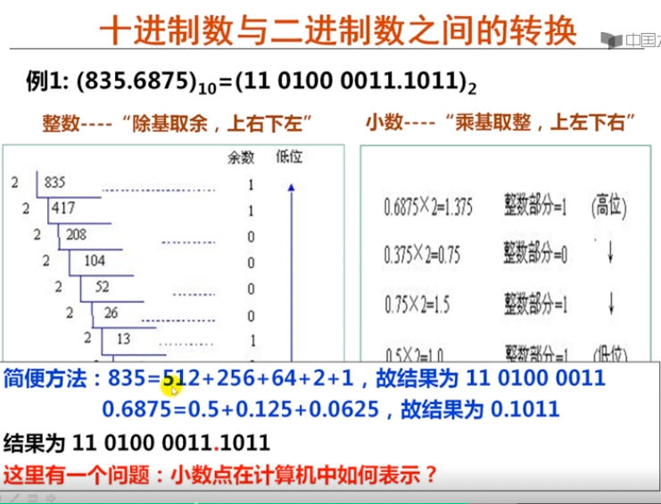

# 2. 2/8/10/16进制数之间的转换

|本期版本|上期版本
|:---:|:---:
`Mon Jan 29 12:14:27 CST 2024` | -

* 小数点在计算中如何表示
* 现实中的精确值可能在机器内部无法用0和1精确表示

## 十进制数与R进制数之间的转换

### R进制数 => 十进制数

* 按 ”权“ 展开

### 十进制数 => 二进制数、再将二进制转换为16或8进制

## Ref

* <https://www.youtube.com/watch?v=XqINC4dpX2c>
* <https://www.youtube.com/watch?v=iH1WnphntMc&list=PLSMlGYT5yLXH63cbYdh6Y7dj-dBWiKrq8&index=9>
* <https://www.youtube.com/watch?v=Us-8Mik_ONY&list=PLSMlGYT5yLXH63cbYdh6Y7dj-dBWiKrq8&index=14>