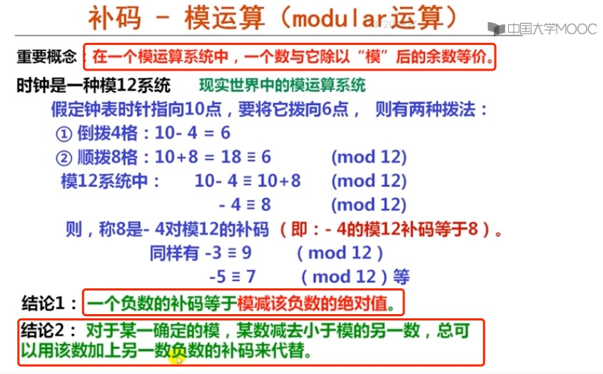
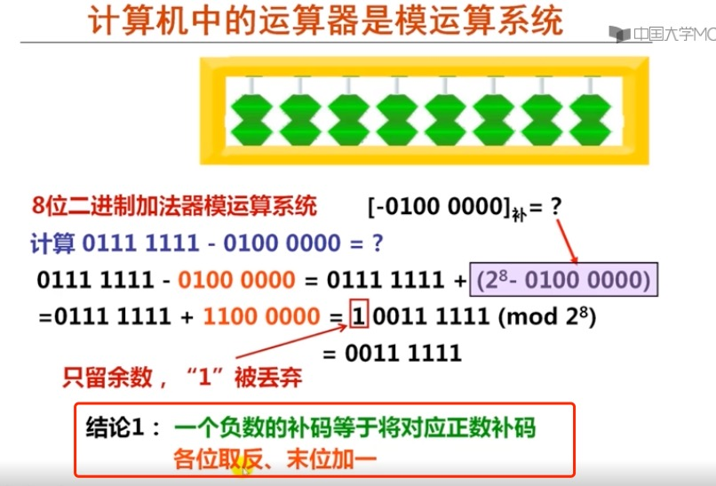
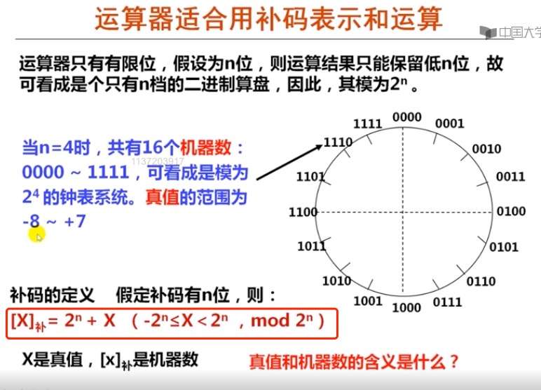

# 2. 模运算系统和补码表示

|本期版本|上期版本
|:---:|:---:
`Mon Jun 17 23:16:06 CST 2024` | -

* 补码： +和-的统一

## Ref

* [补码与模运算 - 琴酒苏打水的博客 | Gin&Soda Blog](https://ginsoda.github.io/computer_science/2021/03/23/two's-complement/)